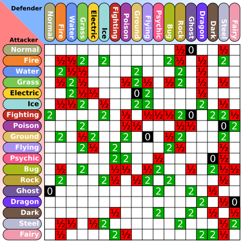
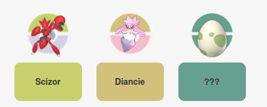

## What is a Type Triangle?

In PokeMon, a **type triangle** refers to a trio of types arranged in a cycle, where each type has a clear advantage over the next one. The obvious example is `Grass > Water > Fire`, but other cycles exist as well, such as `Flying > Fighting > Rock`. 

These rock–paper–scissors loops show up in both casual and competitive teams, as they help cover a large variety of play-styles.

I was motivated by this [video](https://www.youtube.com/watch?v=T_HZYzs-tUA) (which I'd recommend watching, it's great), which explores the best triangles formed from **mono**-types, as alternatives to the traditional `Fire > Grass > Water` trio. At the end, he says he might make a similar video on the best dual type triangles, (two-typed PokeMon), but it's probably impractical due to the sheer number of possible triangles.

And it IS impractical to sift through all of them by hand. There are 18 types, so the number of possible mono-type triangles are `18C3`, or 816. Which is relatively fine.

**However**, there are 153 possible dual-typings. That equates to 585,276 triangles, which is overwhelming. 

**The point of this post is to generate optimal dual-type triangles, algorithmically.**

## Type Charts



The mono-type chart shown above is going to be our best friend throughout this project. Each row corresponds to the attacking type, each column to the defending type, and the value at their intersection tells us how effective that attack is going to be. Essentially,

**W[A,B] answers "How well does A perform against B"?**

### Generating the dual-chart

Building the dual type-chart is the next step. Instead of working with single types, we replace each entry with a pair of types, producing a much larger table: **153 dual types by 153 dual types**, rather than the original 18×18 chart.

Let's consider two dual-types, **X** and **Y**, in the dual type chart, where (X1, X2) and (Y1,Y2) represent their respective component types. W[X,Y] is calculated as :

`(Damage done by X1 on {Y1,Y2}) + (Damage done by X2 on {Y1,Y2})` 

This represents the **aggregate** damage done by X on Y, and in my opinion, is the best judge of the X's effectiveness against Y.

For example, take {Fire/Psychic} against {Ground/Dark} :

- Fire → Ground = 1
- Fire → Dark = 1
- Psychic → Ground = 1
- Psychic → Dark = 0

$$W(Fire/Psychic,Ground/Dark)=(1⋅1)+(1⋅0)=1$$

**At this point, it's helpful to shift our thought process to a graph-oriented view**. This table is essentially an **adjacency matrix**. Each type can be thought of as a node in a graph, and every directed edge has a weight, which represents how effective one type is against another. Because every node is connected to every other node in both directions, the graph is directed, and **EXTREMELY** dense.

## Triangle Calculation

The next step is figuring out how to actually find type triangles. In graph terms, this simply means identifying every group of three nodes where all the nodes are interconnected, i.e. every possible triangle in the graph.

Since every type interacts with every other type, this boils down to systematically examining all three-type combinations and checking how they interact as a cycle.
### There is no escaping O(n^3)!


- The number of candidate triangles is :$$\binom{n}{3} = \Theta(n^3)$$ An optimal triangle, must be compared to EVERY possible triangle. Therefore, no algorithm can be faster than $$\Theta(n^3)$$
- So the naive approach is essentially optimal. The pseudo-code for it is given below:


  <!-- `G be the graph`

  `for A in G:`

	  `for B in G:`
      
		  `for C in G:`

				`if A -> B -> C -> A:`

					`ABC is a triangle.` -->

```python

for A in G:

    for B in G:

        for C in G:

            if A is connected to B is connected to C is connected to A:

                ABC is a triangle

```

**We can, however make some optimisations that'll make it far faster in practice.**

### Pruning the Adjacency Matrix

Most connections here are fairly uninteresting. In order to focus on the interesting edges, we've got to prune the graph.

Consider the `Water > Fire > Grass` triangle. Each type hits the next one for **2x** damage, while taking only **0.5x** in return. That means edges between two points, the two directed edges have a weight difference of 1.5.

$$|W(A,B) - W(B,A)| = 1.5$$

Let's treat this as the benchmark for a "meaningful" edge. An edge that doesn't match this is not gonna contribute to any meaningful triangle.

Using the following mask, we prune the tree, and set all entries that don't meet this criterion to 0.$$∣W(A,B)−W(B,A)∣<1.5$$
This reduced the number of possible triangles (i.e. what we have to sort through in the end) from 585276 to 870. (A **99.85%** decrease!), as well as a reduction in time taken to calculate the triangles, `0.13427` seconds to `0.00536` seconds. (a **99.96%** decrease!)

## What do we mean by "optimal" triangles?

Now, that we've got all worthwhile triangles, all we've gotta do is sort through them, until we find the "optimal" ones. Let's step back though, and answer what that means.

In my mind, an optimal type triangle is one that feels **symmetric**. No single type feels like the obvious best choice, because each type both checks and is checked by the others.

`Grass > Water > Fire` is a great example of a perfectly symmetrical triangle.

- Consider instead, the `Flying > Ground > Rock` triangle. Ground is super-effective against rock, rock is super-effective against flying, but flying is only normally effective against ground, therefore this triangle is offensively asymmetric. 
  
  On top of this, flying is also **immune** to ground. It's clear flying is favoured over the other two here.

- Consider the `Psychic > Fighting > Dark` triangle. Dark is immune to psychic, so it obviously has an edge over the other 2. This triangle is defensively asymmetric.

So, if we want to identify _good_ dual-type triangles, we need a way to quantify symmetry.


### Defining “Balance”

We say a triangle (A,B,C)(A, B, C)(A,B,C) is **balanced** if its edges are roughly equal when moving around the cycle.

- **Offensive balance** means:

$$W(A,B) \approx W(B,C) \approx W(C,A)$$

- **Defensive balance** means:

$$W(B,A) \approx W(A,C) \approx W(C,B)$$


In other words, each type should attack and defend against the others with comparable effectiveness.

### Introducing a metric

The lower the variance of the weights, the higher the symmetry. If all three edges are more or less equal, the variance of the 3 would be close to 0.

We define two functions for a triangle (A,B,C):

**Offensive imbalance**:
$$f_{\text{offensive}}(A,B,C)
=
\operatorname{Var}\bigl(
W(A,B),\,
W(B,C),\,
W(C,A)
\bigr)
$$

**Defensive Imbalance**:
$$f_{\text{defensive}}(A,B,C) = \operatorname{Var}\bigl( W(B,A),\, W(A,C),\, W(C,B) \bigr)$$

To capture both aspects at once, we combine them into a single score:

$$F(A,B,C)=f_{\text{offensive}}(A,B,C)+f_{\text{defensive}}(A,B,C)$$

All we've got left to do is sort the triangles based on this score, and we've got a list of the most optimal triangles.

# Results

I filtered out any triangles that consisted of all Fire, Grass, and Water types, as I wanted some novel triangles.
## 1. Fire/Psychic – Grass/Fighting – Ground/Dark 


### Score : 0.0

What's interesting here, is that the triangle compensates for dark's immunity to psychic by pairing it with ground, which takes neutral damage from fire. So although all the nodes aren't *uniform*, the triangle at large is symmetric.

## 2. Bug/Steel – Fire/Ice – Rock/Fairy


### Score : 0.0

Each node in this triangle can hit one opponent for a full 4× multiplier, while taking at worst neutral damage in response. That makes the loop surprisingly brutal, but no one type dominates the other.

## 3. Electric/Dark – Fighting/Ground – Flying/Psychic


### Score : 0.00347

This is a triangle with lots of immunities. It combines two mono-type triangles—one that slightly disfavors Electric and another that favors Dark—and blends them into a pretty symmetric loop. It does slightly favour Flying/Psychic, as it takes 0.25X damage from fighting.

## 4. Dark/Steel – Fighting/Dark – Rock/Fairy


### Score : 0.00347

Dark appears twice here, and yet the triangle remains balanced. I'm not rating this as highly as the others, as it's not as diverse.

[GitHub Link](https://github.com/suhankd/pokemon-type-triangles)