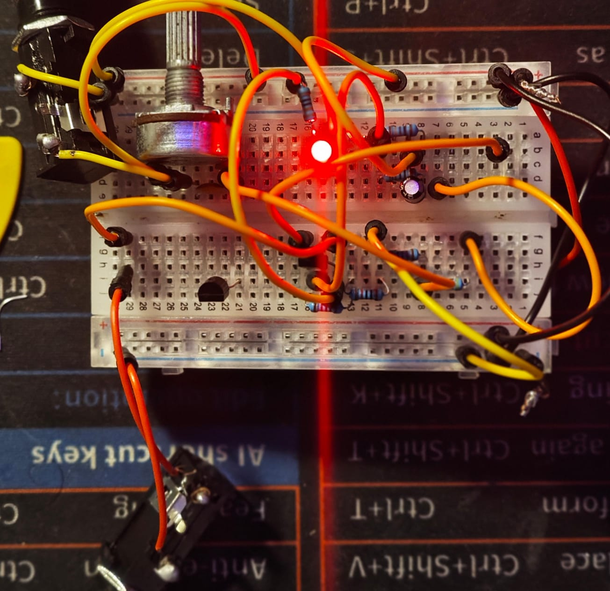
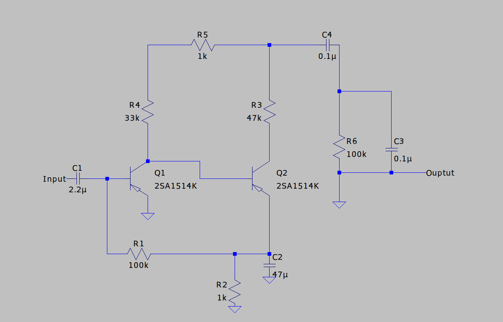
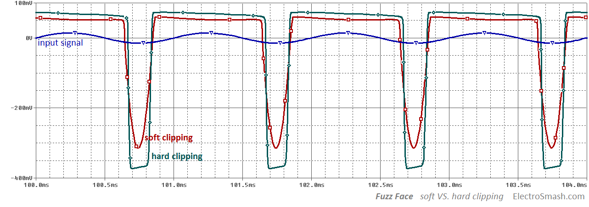

Going to be a pretty short read, just explaining some interesting aspects of the circuit.

This is a Fuzz-Face derivative, the Hendrix-era sound. It's a positive-ground circuit, which used Germanium PNP transistors, though I've used silicon. The schematic is shown below.

The BJTs were annoying as hell to work with. The gain never stayed constant for any meaningful period of time, and with a circuit this sensitive, the distortion went to shit every time they varied. Might be cos of manufacturing defects, but I'm a MOSFET fan now.

## Signal Overview

This pedal conducts asymmetric clipping, as shown below. At the clip point (Q1's collector voltage), the signal clips, producing a distorted waveform.

## Schematic Overview

The capacitor, coupled with the potentiometer, helps bypass higher frequencies. The tone gets brighter as the potentiometer is maxed along with the volume.

The circuit is just two common-emitter stages stacked together. Q1 provides initial gain, but more importantly, it drives Q2, where most of the distortion occurs.

The feedback loop from Q2 to Q1 sets the circuit’s bias, letting it self-adjust instead of relying on fixed biasing.

Because of this, the operating point depends heavily on the transistor properties, making the circuit very sensitive to gain variations.

The capacitor coupled with the potentiometer helps bypass higher frequencies. The tone gets brighter as the potentiometer is maxed along with the volume.

I could've chosen to omit the output cap to add some extra noise to the signal, but I checked the voltage there and it was close to -4V. I didn’t want to damage my amp, so I kept it.

## Testing

<iframe width="560" height="315" src="https://www.youtube.com/embed/jybrcZpjhag" frameborder="0" allowfullscreen></iframe>